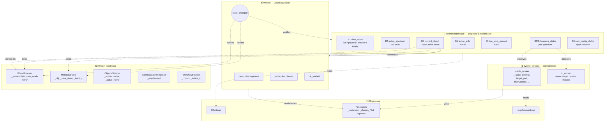
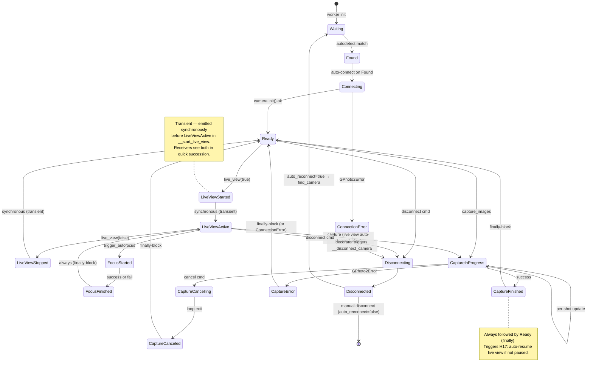
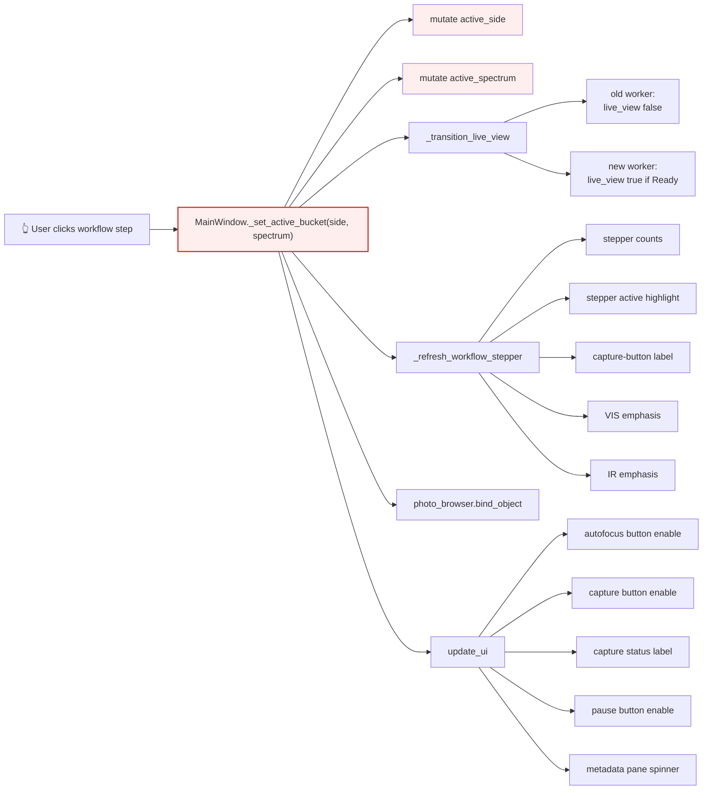
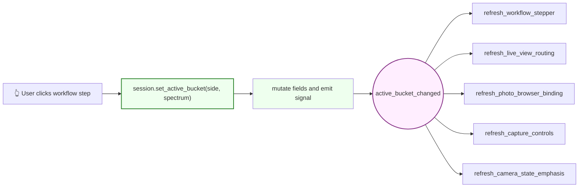

# Papyri state survey

Verification target for the upcoming `SessionState` refactor. Documents every distinct piece of state in the running app, the transitions between values, the cross-axis invariants that must hold, and the edge cases the refactor must keep passing.

> **Status**: 2026-05-08 — refactor complete on branch `refactor/session-state` (Stages 0–6). All 8 axes migrated to `SessionState`. This doc reflects the post-refactor shape; the "before" reactivity diagram in §2.3 is kept as a historical record.

## How to read this doc

1. **§2 Visual overview** — start here. Three diagrams give the conceptual shape.
2. **§3 State axes** — the 8 primary axes (the dimensions of the app's state).
3. **§4–§8** — detail per state location (model, worker, widgets, persistent).
4. **§9 Invariants** + **§10 Edge cases** — the rules and tricky cases.
5. **§13 Verification checklist** — use during refactor to make sure nothing was lost.

## Contents

1. [Scope](#1-scope)
2. [Visual overview](#2-visual-overview)
2.5. [Architecture: `SessionState`](#25-architecture-sessionstate)
3. [State axes — primary (orchestrator level)](#3-state-axes--primary-orchestrator-level)
3a. [Widget reactivity matrix](#3a-widget-reactivity-matrix)
4. [State held inside `Object` (model)](#4-state-held-inside-object-model)
5. [Camera substates](#5-camera-substates)
6. [State held inside `CameraWorker` (worker thread)](#6-state-held-inside-cameraworker-worker-thread)
7. [State held inside other widgets](#7-state-held-inside-other-widgets)
8. [Persistent (off-process) state](#8-persistent-off-process-state)
9. [Cross-axis invariants](#9-cross-axis-invariants)
10. [Edge cases & verification scenarios](#10-edge-cases--verification-scenarios)
11. [Operating modes](#11-operating-modes)
12. [Findings worth flagging](#12-findings-worth-flagging)
13. [Verification checklist](#13-verification-checklist)

---

## 1. Scope

What this survey covers:
- Process-lifetime state owned by widgets/QObjects in the running app.
- External state the app reads/writes (filesystem, gphoto2 settings file, `QSettings`).
- Implicit state: signal connections, timer pending-flags, in-flight commands.

What it deliberately excludes:
- Layout / geometry / styles (QSS, sizes, splitter ratios) — not behavioral state.
- Worker thread internals that don't affect observable behavior (e.g., `QTimer` instance, `thread.isInterruptionRequested()` as a read-only signal).

Two dimensions matter for every axis:
1. **Storage location** — where the field lives.
2. **Mutation surface** — what code can change it. The refactor's promise is to shrink this to one entry point per axis.

---

## 2. Visual overview

### 2.1 State landscape — where state lives

Four layers; each with its own mutation discipline. The refactor's `SessionState` only owns the top layer.



**Reading the diagram**: solid arrows are references (ownership); dotted arrows are observations (signals/reads). The orchestrator at the top is small (8 axes); the work happens by other layers reacting to signals from it. The refactor target is to make every observation arrow start from a `SessionState` signal — not from a MainWindow field accessed reactively.

### 2.2 Camera substate machine

The worker's state machine. Same shape for both VIS and IR — they run independently. **18 distinct substates**; payload-bearing ones noted with `(…)`.



**Note on `IOError`**: defined as a substate but not raised anywhere in the code. Likely dead — see [§12](#12-findings-worth-flagging).

### 2.3 Reactivity fan-out — before vs. after the refactor

Same user action, two control flows — kept here as a record of *why* the refactor mattered. The "after" shape is what `SessionState` implements today; the "before" is the historical pre-refactor pattern.

#### Before — `_set_active_bucket` mutates and dispatches manually



The red node is the only mutator AND the dispatcher. To trace effects you have to read 6 methods. Adding a new effect means editing `_set_active_bucket` (or one of the refreshers it calls). State is not separable from dispatch.

#### After — `SessionState.set_active_bucket` mutates; receivers subscribe



The green node is the only mutator. Receivers subscribe; the mutator doesn't know about them. Adding a new effect means writing one new receiver and connecting it — no edit to `set_active_bucket`. To trace effects, `grep "active_bucket_changed.connect("`.

---

## 2.5 Architecture: `SessionState`

Orchestrator state lives on a single `SessionState` QObject (`papyri/session_state.py`). `MainWindow` owns it; widgets stay state-agnostic. Mutations go through setters that emit `*_changed` signals; receivers in `MainWindow` subscribe and call widget APIs. Eight rules — locked into the comment block at the top of `_wire_session()` — keep the pattern honest:

1. **Receivers read from `session.X`, never from signal args.** Makes them idempotent — safe to call from anywhere (initial paint, manual invocation, etc.).
2. **All `.connect()` calls live in `_wire_session()`.** Single grep target for "what reacts to what".
3. **No lambda connects** unless binding args. Greppable named methods only.
4. **`_refresh_X` for UI repaints** (no side effects); **`_handle_X` for business logic / commands**. Suffix names the property set (`_enable`, `_visible`, `_text`, `_color`, `_binding`, `_emphasis`) — `_state` / `_status` / `_appearance` are red flags that the receiver is doing too much.
5. **Atomic groupings** — one setter per logical change (e.g. `set_active_bucket(side, spectrum)`, not two setters). Receivers see consistent state.
6. **Setters mutate + emit only.** No worker commands, no widget calls, no business logic. (Exception: `set_camera_state` logs the transition since it's the source of truth.)
7. **Type hints on every setter / getter / signal.** State shape is greppable.
8. **Log every mutation.** One INFO line per axis change. Lets you reconstruct a session by reading the log — essential for verifying IR paths without IR hardware.

**Multi-subscribe is normal**: a receiver depending on multiple axes connects to each (`s.A_changed.connect(self._refresh_X); s.B_changed.connect(self._refresh_X)`). It re-reads from session each call so over-running is harmless.

**Match form for state-machine receivers**: camera-state receivers (`_handle_camera_lifecycle`, `_handle_active_camera_state`, `_refresh_camera_dependent_ui`) each contain a `match camera_state:` block. The state machine has 18 enumerated substates — match preserves the per-state scan ("what does Ready cause?") within each concern.

**Imperative handlers** are allowed when the work is inherently history-dependent (`_handle_live_view_handoff(old, new)` — the OLD spectrum is gone from session by the time we want to use it). Called from action handlers, not from signal subscribers.

---

## 3. State axes — primary (orchestrator level)

These are the axes `SessionState` owns. Each axis has one storage location, one setter, one signal (where reactive observers exist), and a flat list of receivers wired in `_wire_session()`.

| # | Axis | Type | Setter | Signal | Receivers (in `MainWindow`) |
|---|------|------|--------|--------|------------------------------|
| **B1+B2** | Active bucket (atomic side+spectrum) | `(SIDE_A\|SIDE_B, SPECTRUM_VISIBLE\|SPECTRUM_INFRARED)` | `session.set_active_bucket(side, spectrum)` | `active_bucket_changed(str, str)` | `_refresh_workflow_stepper_active`, `_refresh_capture_button_label`, `_refresh_camera_state_emphasis`, `_refresh_photo_browser_binding` (also subscribes to B5). IR-fallback enforced caller-side in `_on_workflow_step_clicked`; `_handle_live_view_handoff(old, new)` invoked imperatively from same caller because old value isn't in session by emission time. |
| **B3+B4** | Camera state per spectrum | `dict[spectrum, CameraStates.* \| None]` | `session.set_camera_state(spectrum, state)` | `camera_state_changed(str, object)` | `_handle_camera_lifecycle` (per-spectrum: Found→connect, Disconnected→reconnect, Disconnecting→cam-config-dialog reject), `_handle_active_camera_state` (active-only: Ready→live view auto-resume, error logging, Disconnected→view_mode="empty"), `_refresh_camera_dependent_ui` (autofocus enable, capture status, capture/pause button enables — also subscribes to B5). |
| **B5** | Current object reference | `Object \| None` (identity-compare in setter) | `session.set_current_object(obj)` | `current_object_changed(object)` | `_refresh_metadata_pane_binding`, `_refresh_objects_sidebar_active`, `_refresh_objects_sidebar_entries`, `_refresh_workflow_stepper_counts`, `_refresh_workflow_stepper_active`, `_refresh_photo_browser_binding`, `_handle_current_object_subscription` (manages `Object.state_changed` connection + initial refresh), `_handle_current_object_view_mode_reset` (sets view_mode="empty" on close). |
| **B6** | Live-view paused intent | `bool` | `session.set_live_view_paused(paused)` | `live_view_paused_changed(bool)` | `_refresh_pause_button_text` (UI mirror — F-DUP fix; pause button is no longer source of truth), `_handle_live_view_paused` (emits `live_view` command on active worker). |
| **B7** | Viewer mode | `("live"\|"paused"\|"preview"\|"empty", label)` atomic | `session.set_view_mode(mode, label="")` | `view_mode_changed(str, str)` | `_refresh_view_mode_indicator` (calls `photo_browser.set_view_state(...)`). |
| **B8** | Per-camera advanced-config dialog | `(CameraConfigDialog \| None, spectrum \| None)` atomic | `session.set_cam_config_dialog(dialog, spectrum)` | (no signal — only inline gate observes) | Inline check in `_handle_camera_lifecycle` rejects the dialog when its spectrum's camera goes Disconnecting. |

### Derived (computed, never stored)

| # | Derivation | Formula |
|---|------------|---------|
| D1 | `active_worker` | `ir_worker if active_spectrum==IR and ir_worker is not None else visible_worker` |
| D2 | `camera_state` (active) | `camera_states[active_spectrum]` |
| D3 | `has_object` | `current_object is not None` |
| D4 | `object_loaded` | `has_object and current_object.dir_loaded` |
| D5 | `camera_ready` | `isinstance(camera_state, (Ready, LiveViewStarted, LiveViewActive, FocusStarted, FocusFinished, CaptureFinished))` |
| D6 | `capture_button_enabled` | `camera_ready and object_loaded` |
| D7 | `is_ir_configured` | `ir_worker is not None` (i.e. `irProfile` was set at startup) |

---

## 3a. Widget reactivity matrix

§3 reads top-down ("axis B2 changes → these methods react"). This section reads inverted ("widget X — what drives it?"). Use this when debugging *"why is the autofocus button disabled right now?"* or when wiring a refactored receiver.

Grouped by screen region. Within each group: every visible control with its enabled / visible / content drivers and the source code that updates it.

### 3a.1 Top bar — workflow stepper

| Widget / property | Driven by | Notes | Source |
|---|---|---|---|
| Stepper itself | always visible | static layout | `main_window.ui` |
| Chevron — fill color | per-step state: active / done / pending (active wins on ties) | derived inside widget from `_active_id` and `_counts[id]` | `WorkflowStepper._paint_chevron` |
| Chevron — border | active = 2px group base color; done = 1px tint; pending = 1px grey | | same |
| Number medallion | always visible; auto-numbered cumulatively across groups | | same |
| Group pill in chevron (e.g. "VIS") | always visible | bg = group's base color | same |
| Step label (e.g. "Side A") | always visible | text per `WorkflowStep.label` | same |
| Status row text | "● WORKING" / "● WORKING · N done" / "✓ COMPLETED · N" / "○ PENDING" | derived from active-flag + count | same |
| Bracket above group | always visible | label per `WorkflowGroup.label` | `_paint_bracket` |
| Stepper click → bucket switch | translates step_id → (B1, B2) | IR steps fall back to VIS if no IR worker (H1) | `_on_workflow_step_clicked` |

### 3a.2 Camera-state widgets (VIS / IR)

| Widget / property | Driven by | Notes | Source |
|---|---|---|---|
| VIS widget — visible | always | static | `_wire_camera` |
| IR widget — visible | `is_ir_configured` (D7) | hidden once at startup if no IR profile (cannot toggle at runtime, F-PERS-1) | `_wire_camera` |
| Side badge ("VIS" / "IR") | binding label | colored bg per spectrum | `bind_worker` |
| Outer pill border | `_emphasized` (set by `set_emphasized` from main.py based on B2) | 2px spectrum-colored when emphasized; 1px grey otherwise | `_refresh_chrome` |
| Camera icon | per worker's last `state_changed`: Waiting/Found/Connecting/Disconnecting → camera_waiting; Disconnected/ConnectionError → camera_not_ok; all "connected" states → camera_ok | self-wired direct from worker, NOT from B3/B4 | `CameraStateWidget._on_state` |
| Status text | per state, formatted with camera_name when available | rich text with `<b>` for name | same |
| Spinner — animating | Waiting / Found / Connecting / Disconnecting | idle in Disconnected, ConnectionError, all "connected" states | same |
| Connect button — visible | Disconnected, ConnectionError | otherwise hidden | same |
| Connect button — enabled | always when visible | | same |
| Disconnect button — visible | all "connected" states (Ready / LiveView* / Capture* / Focus*) + Disconnecting | otherwise hidden | same |
| Disconnect button — enabled | true except during Disconnecting | so user can't double-disconnect | same |

### 3a.3 Settings button & menus

| Widget / property | Driven by | Notes | Source |
|---|---|---|---|
| Settings button | always visible / enabled | | `main_window.ui` |
| "General settings" menu item | always visible / enabled | opens `PapyriSettingsDialog` (modal). On close, warns if `irProfile` changed (F-PERS-1) — IR worker is constructed once at startup. | `open_settings` |
| "Configure VIS camera…" menu item | enabled when VIS camera ∈ Ready-ish states | gated via `aboutToShow` → `_refresh_settings_menu_state`; opens dialog scoped to VIS worker | `open_advanced_camera_config(VISIBLE)` |
| "Configure IR camera…" menu item | visible iff IR profile configured (D7); enabled when IR camera ∈ Ready-ish states | per-camera (option A from design discussion) — at most one dialog open, scoped to its specific camera | `open_advanced_camera_config(INFRARED)` |

### 3a.4 Objects sidebar (left rail)

| Widget / property | Driven by | Notes | Source |
|---|---|---|---|
| Sidebar — visible | toggleable via Cmd+/ (default: visible) | | `_wire_actions` shortcut |
| Header text | "OBJECTS" or "OBJECTS  N/M done" | derived from entries' completeness | `_update_header_count` |
| Working dir label | text from `_working_dir` or "No working directory selected" | tooltip = full path | `_refresh_workdir_label` |
| List of objects | from disk scan via `list_managed_objects` | re-scanned on `refresh()` (cheap) | `_scan` |
| Per-row badge | `·` empty / `??` captures + incomplete meta / `✓` captures + complete meta | per `ObjectListEntry.badge` | `_populate` |
| Per-row text | `" {badge}    {name}"` | | `_populate` |
| Active row highlight | row matching `B5.name` | clears when B5 = None | `_sync_selection` |
| "+ New object" button | always visible / enabled | emits `new_object_requested` | static |

### 3a.5 Metadata pane

| Widget / property | Driven by | Notes | Source |
|---|---|---|---|
| Pane — visible | toggleable via Cmd+\ (default: visible) | | `_wire_actions` shortcut |
| Pane width | splitter-controlled; default 200px, min 150px | user-draggable | `main_window.ui` splitter |
| Name field — read-only | `B5 is not None` | editable (with chrome) when no object bound | `_refresh_title_row` |
| Name field — content | object's name (when bound), empty (placeholder) otherwise | | same |
| Inline spinner | animating when `has_object AND NOT object_loaded` (D3 ∧ ¬D4) | driven by `set_loading_busy` from `_refresh_camera_dependent_ui` | `set_loading_busy` |
| Rename button (✏) | visible when B5 is not None | emits `rename_requested` | `_refresh_title_row` |
| Close button (×) | visible when B5 is not None | emits `close_requested` | same |
| Subtitle text | "X/4 buckets" filled, derived from object's per-bucket counts | empty when no object; refreshes on object's `state_changed` | `_refresh_subtitle` |
| METADATA header | "METADATA" or "METADATA  N/M required" | depends on schema completeness when object bound; "METADATA" when no object or no required fields | `_update_header` |
| Form fields (per schema) | enabled when B5 is not None; content from `_meta.json` via `_populate_from_disk` | string → QLineEdit (focus-loss save); choice → QComboBox (immediate save); longtext → QPlainTextEdit (debounced 500ms save) | `_set_form_enabled`, `_create_widget` |
| Form labels | always visible (per schema); trailing " *" when required | | `_build_ui` |

### 3a.6 Photo browser — viewer

| Widget / property | Driven by | Notes | Source |
|---|---|---|---|
| Viewer (QGraphicsView) — visible | always | | `photo_browser.ui` |
| Viewer content | live frame (B6 = False AND active worker streaming preview); last live frame (frozen on pause); user-selected capture (clicked thumb); nothing (initial / after `close_directory`) | the viewer doesn't track state — whoever calls `setPhoto` last wins | `show_preview`, `__on_select_image_file` |
| Viewer border — color | per B7 (cyan solid / amber dashed / grey solid / faint grey) | applied via stylesheet on `QGraphicsView#photoViewer` | `_refresh_view_state_indicator` |
| Viewer pill — visible | B7 != "empty" | | same |
| Viewer pill — text + border color | per B7: "● LIVE" cyan / "⏸ PAUSED" amber / "📷 {label}" grey | label = file stem when "preview", else "Preview" | same |
| Viewer pill — position | top-right of viewport, re-anchored on resize via eventFilter | never overlaps a vertical scrollbar | `_reposition_view_state_pill` |

### 3a.7 Photo browser — filmstrip & thumbnails

| Widget / property | Driven by | Notes | Source |
|---|---|---|---|
| Filmstrip (QListWidget) — visible | always (in loupe layout) | | `use_loupe_layout` |
| Filmstrip flow direction | LeftToRight (loupe), no wrap, horizontal scroll | | same |
| Filmstrip — current item | last clicked OR last loaded (auto-selected during load) | `image_selected` fires only on USER click (H22) | `__add_image_item` disconnect/reconnect |
| Filmstrip — scroll position | scrolled to bottom on each new item add | | `__add_image_item` |
| Filmstrip — items | one per file in bound directory; added on FS-watcher diff | watched path changes via `bind_object` → `open_directory` | `__load_directory` |
| Thumbnail image | from async `LoadImageWorker` (embedded JPEG preview for RAWs — fast) | full decode reserved for viewer click | same |
| Thumbnail caption — gradient strip | always painted at bottom of thumb | transparent → ~60% black gradient | `_ChosenStarDelegate._paint_caption` |
| Thumbnail caption — stem text (top, bold) | from `item.file_name` (extension stripped) | elided middle if too long | same |
| Thumbnail caption — EXIF line (bottom) | from `item.text()` second line (`"f/X | 1/Y"`) | populated when item added with EXIF | same |
| Thumbnail ★ overlay | when stem == `current_object.chosen(B1, B2).stem` | re-painted when bound object's `state_changed` fires | `_ChosenStarDelegate._paint_star` |
| Thumbnail selection highlight | Qt's default item-selected style | | Qt |
| Right-click menu — "Mark as chosen ★" | enabled when this stem != currently chosen | calls `obj.set_chosen(side, spectrum, stem)` | `PapyriCaptureBrowser._build_context_menu` |
| Right-click menu — "Move to side B/A" | always enabled when object bound | shows confirmation; calls `obj.move(...)` | same |
| Right-click menu — "Delete capture…" | always enabled when object bound | shows confirmation; sends to trash via `send2trash` | same |
| Loading spinner (centered over viewer) | animating when `__num_images_to_load > 0` | starts on `__load_image`, stops in `__on_image_loaded` decrement | `__load_image`, `__on_image_loaded` |

### 3a.8 Bottom bar — capture controls

| Widget / property | Driven by | Notes | Source |
|---|---|---|---|
| Pause Live View button — enabled | `camera_ready` (D5) | disabled in Waiting / Found / Connecting / Disconnecting / Disconnected / ConnectionError / CaptureInProgress / CaptureCancelling / CaptureCanceled / CaptureError | `_refresh_camera_dependent_ui` |
| Pause Live View button — text + checked | "Pause Live View" / "Resume Live View" per B6 (F-DUP fixed — button is now a UI mirror of session.live_view_paused, no longer source of truth) | | `_refresh_pause_button_text` |
| Autofocus button — enabled | active camera ∈ {LiveViewStarted, LiveViewActive, FocusFinished} | disabled in all other states | `_refresh_camera_dependent_ui` match |
| Capture status label — text | per active camera state — Capturing… (CaptureInProgress) / "Captured: x.jpg, y.arw" (CaptureFinished) / "Capture canceled." (CaptureCanceled) / "Error: {err}" (CaptureError) / "Could not focus." (FocusFinished success=False) | empty in Waiting; previous text persists in unhandled states | same |
| Capture status label — color | red on focus-fail / cancel / error; mid-grey on CaptureFinished; default otherwise | | same |
| Capture button — enabled | `camera_ready AND object_loaded` (D5 ∧ D4) | multi-subscribed to `camera_state_changed` AND `current_object_changed` | `_refresh_camera_dependent_ui` |
| Capture button — text | `"Capture · Side {A/B} · {Visible/Infrared}"` per B1 + B2 | | `_refresh_capture_button_label` |

### 3a.9 Modal dialogs

| Dialog | Triggered by | Modality | Notes | Source |
|---|---|---|---|---|
| `PapyriSettingsDialog` | Settings menu → "General settings" | modal | writes back QSettings: profile (triggers VIS reconnect), irProfile (warns user to restart — F-PERS-1 fixed), workingDirectory (refreshes sidebar), maxPixmapCache (live-applies), enableSecondScreenMirror | `open_settings` |
| `CameraConfigDialog` | Settings menu → "Configure VIS camera…" or "Configure IR camera…" (per-camera) | non-modal | auto-`reject()` when **its** spectrum's camera goes Disconnecting (per-camera, not active-spectrum-keyed) | `open_advanced_camera_config(spectrum)` |
| Move-capture confirmation | Right-click thumbnail → "Move to side B/A" | modal Yes/Cancel | | `_confirm_and_move` |
| Delete-capture confirmation | Right-click thumbnail → "Delete capture…" | modal Yes/Cancel | | `_confirm_and_delete` |
| Rename input dialog | ✏ button | modal text + Ok/Cancel | invokes full rename flow (re-prefixes files in all 4 buckets, rewrites `_chosen_*.txt`, renames dir) | `rename_current_object` |
| Object-already-exists warning | `start_object` when target dir exists | modal info | refuses silent takeover | `start_object` |

### 3a.10 Keyboard shortcuts

| Shortcut | Action | Source |
|---|---|---|
| Cmd+/ (Ctrl+/ on Win/Linux) | Toggle objects sidebar visibility | `_wire_actions` |
| Cmd+\ (Ctrl+\ on Win/Linux) | Toggle metadata pane visibility | `_wire_actions` |

### 3a.11 Process-level effects

These aren't widgets but are user-visible side effects worth tracking.

| Effect | Driven by | Source |
|---|---|---|
| `QPixmapCache` cleared | `PhotoBrowser.close_directory` (every object swap) | `close_directory` |
| `QPixmapCache` size limit | `maxPixmapCache` QSettings (live-applies on change) | `open_settings`, init |
| `QFileSystemWatcher` watched paths | flips with `open_directory` / `close_directory` (one path at a time) | `start_watching`, `stop_watching` |
| Window title | "Papyri Capture" — static | `main()` |

---

## 4. State held inside `Object` (model)

`Object` is a model (subclass of `QObject`). Its fields are state but **not** orchestrator-level — `SessionState` references the Object, doesn't replicate it.

| # | Field | Type | Mutator | Observer |
|---|-------|------|---------|----------|
| C1 | `working_dir` | str | constructor | path derivations |
| C2 | `name` | str | constructor; new instance constructed and passed to `session.set_current_object` after rename | path derivations |
| C3 | `dir` | str | constructor | path derivations |
| C4 | `dir_loaded` | bool | set via `Object.mark_dir_loaded()` (called from `_on_directory_loaded`) | `_refresh_camera_dependent_ui` capture-button gate |
| C5 | `_captures: dict[bucket, list[Capture]]` | per-bucket file list | `refresh()` (re-scan disk) | `count()`, `captures()`, browser ★, sidebar badge, subtitle |
| C6 | `_chosen: dict[bucket, Capture \| None]` | persisted in `_chosen_*.txt` | `set_chosen()`, `refresh()` (re-resolve), implicit clear in `move()` | browser ★, future RTI / processing exports |
| C7 | `state_changed` signal connections | signal-receiver list | `connect`/`disconnect` from main.py, capture_browser, metadata_pane | (the receivers themselves) |

**Quirk (C4 cross-layer)**: `dir_loaded` is set by main.py's handler onto the Object — main.py mutates a model field. This is a small architectural smell; `Object` could either expose `mark_dir_loaded()` or `dir_loaded` could move to `SessionState`.

**Leak risk (C7)**: `MetadataPane.bind_object` connects `obj.state_changed.connect(self._refresh_subtitle)` but **never disconnects** on rebind. Today it's harmless because main.py holds the only strong ref to the previous Object and replaces it; but if anything else ever held a ref, the previous object's signal would still fire into `_refresh_subtitle` with a stale `_obj`. Worth fixing.

---

## 5. Camera substates

From `byzanz_camera/camera_worker.py:114–203`. **18 distinct types**; payload-bearing ones noted.

### 5.1 Substate enumeration

| Substate | Payload | Meaning |
|----------|---------|---------|
| `Waiting` | — | initial; no camera detected yet |
| `Found` | `camera_name: str` | autodetect saw a model matching the profile pattern |
| `Connecting` | `camera_name: str` | `connect_camera` in flight |
| `Disconnecting` | — | `disconnect_camera` in flight |
| `Ready` | `camera_name: str` | camera open; no live view yet |
| `LiveViewStarted` | `current_lightmeter_value: int` | first live-view frame is on its way (NamedTuple) |
| `LiveViewActive` | — | streaming frames |
| `LiveViewStopped` | — | live view ended, camera still open |
| `FocusStarted` | — | autofocus kicked off |
| `FocusFinished` | `success: bool` | autofocus done (NamedTuple) |
| `CaptureInProgress` | `capture_request, num_captured` | shutter command in flight; re-emitted per-shot |
| `CaptureFinished` | `capture_request, elapsed_time, num_captured, file_paths` | saved to disk |
| `CaptureCancelling` | — | user requested cancel |
| `CaptureCanceled` | `capture_request, elapsed_time` | cancel completed |
| `CaptureError` | `capture_request, error: str` | capture failed |
| `Disconnected` | `camera_name, auto_reconnect: bool` | USB gone or worker disconnected |
| `IOError` | `error: str` | low-level libgphoto2 I/O fault — **never raised in code** (see §12) |
| `ConnectionError` | `error: gp.GPhoto2Error` | wrapped exception during connect/init |

The `__handle_camera_error` decorator (line 311) funnels camera-side exceptions to `ConnectionError` and forces a disconnect.

### 5.2 Transition table

For each substate: who can transition INTO it, what successors are emitted.

| Substate | Predecessors (typical) | Successors (typical) |
|----------|------------------------|----------------------|
| `Waiting` | initial; or `__find_camera` reset | `Found` (when match) |
| `Found` | `Waiting` | `Connecting` (auto, via `_on_camera_state_changed` Found→connect) |
| `Connecting` | `Found` | `Ready` (success) or `ConnectionError`→`Disconnected` (failure via decorator) |
| `Disconnecting` | `disconnect_camera` cmd | `Disconnected` |
| `Disconnected` | `Disconnecting`, `__handle_camera_error` | `Waiting`→`Found` (if `auto_reconnect=True`); terminal otherwise |
| `Ready` | `Connecting` (success); after capture; after `LiveViewStopped` | `LiveViewStarted` (live_view cmd); `CaptureInProgress`; `Disconnecting` |
| `LiveViewStarted` | `Ready` via `__start_live_view` | immediately followed by `LiveViewActive` |
| `LiveViewActive` | `LiveViewStarted`; `FocusFinished` (via `__trigger_autofocus` finally) | `LiveViewStopped` (live_view false); `FocusStarted`; `CaptureInProgress` |
| `LiveViewStopped` | `__stop_live_view` | `Ready` (immediately follows in `__stop_live_view`); `LiveViewStarted` (resume) |
| `FocusStarted` | `LiveViewActive` via `trigger_autofocus` | `FocusFinished` (always, success or fail) |
| `FocusFinished` | `FocusStarted` | `LiveViewActive` (always — `__trigger_autofocus` finally) |
| `CaptureInProgress` | `Ready` or `LiveViewActive` via `captureImages` | per-shot `CaptureInProgress` updates; then `CaptureFinished` / `CaptureCanceled` / `CaptureError` |
| `CaptureCancelling` | `__cancel` cmd | `CaptureCanceled` (eventually, when capture loop sees `shouldCancel`) |
| `CaptureCanceled` | post-cancel | `Ready` (finally-block) |
| `CaptureFinished` | end of `captureImages` | `Ready` (finally-block) |
| `CaptureError` | exception during capture | `Ready` (finally-block) or `ConnectionError` if recovery fails |
| `IOError` | (never raised in code) | — |
| `ConnectionError` | `__handle_camera_error` decorator | `Disconnecting` → `Disconnected` (caller calls `__disconnect_camera()`) |

**Useful invariant**: every "operating" state (`Ready`, `LiveView*`, `Focus*`) eventually returns to `Ready` after capture. That's why H17 ("auto-resume live view on each `Ready` if not paused") is the right hook for post-capture live-view resume — confirmed against the code.

---

## 6. State held inside `CameraWorker` (worker thread)

These don't belong in `SessionState` (they're worker-internal), but the refactor must not reach into them.

| # | Field | Type | Lifecycle | Notes |
|---|-------|------|-----------|-------|
| D1 | `__state` | `CameraStates.*` | set on every transition via `__set_state`; emits `state_changed` | the canonical state machine |
| D2 | `camera` | `gp.Camera \| None` | None → set on Connect → cleared on Disconnect | resource handle; not state per se but co-varies with state |
| D3 | `camera_name` | `str \| None` | set on Connect | lives past Disconnect (kept for messaging) |
| D4 | `target_model_pattern` | `str \| None` | set by orchestrator before `find_camera` | continuity from find→connect |
| D5 | `target_port` | `str \| None` | set by `__find_camera` after match, used by `__connect_camera` | continuity |
| D6 | `filesCounter` | int | reset to 0 each capture | intra-capture transient |
| D7 | `captureComplete` | bool | reset false at start, set true on `GP_EVENT_CAPTURE_COMPLETE` | intra-capture transient |
| D8 | `shouldCancel` | bool | set true by `__cancel`; reset false in finally | intra-capture transient |
| D9 | `liveView` | bool | set false in `__init__`, **never read** | **DEAD** — finding F1 |
| D10 | `__saved_config` | `gp.CameraWidget` | written once on connect; read only by commented-out code | **likely dead** — finding F8 |
| D11 | `__last_ptp_error` | `NikonPTPError` | set by `gp_log_add_func` callback; consumed by `__trigger_autofocus` | side-channel state populated by libgphoto2 logging |
| D12 | `__last_config_poll` | float (timestamp) | rate-limit for `__emit_current_config` polling | timing transient |
| D13 | `profile` | `Profile` | set on Connect | drives all per-camera behavior |
| D14 | `captured_file_paths` | list[str] (lazy attr) | created via `if not hasattr` mid-capture | **ugly**; per-capture transient |

---

## 7. State held inside other widgets

Each carries its own state. The refactor's `SessionState` should NOT absorb these — they're widget-local. But the matrix matters for understanding ripples.

### 7.1 `PhotoBrowser` (and `PapyriCaptureBrowser` extension)

| Field | Notes |
|-------|-------|
| `__currentPath` | currently-watched directory |
| `__currentFileSet` | last-known set of basenames (diff target) |
| `__num_images_to_load` | spinner gate (0 = idle) |
| `_view_state`, `_view_state_label` | mirror of the chosen viewer mode |
| `_view_state_pill`, `photo_viewer.styleSheet` | derived from view_state |
| `image_file_list.currentItem()` | last-clicked or auto-selected thumb |
| `__ctx_menu_provider` | callable injected by subclass |
| `QFileSystemWatcher` watched paths | implicit; flips with open/close_directory |
| `QPixmapCache` (process-global) | cleared on `close_directory` — global side effect! |

### 7.2 `PapyriCaptureBrowser` (subclass)

| Field | Notes |
|-------|-------|
| `_obj`, `_side`, `_spectrum` | currently-bound bucket — re-derives chosen-stem when state_changed fires |
| `_delegate._chosen_stem` | per-paint chosen-stem state |

### 7.3 `MetadataPane`

| Field | Notes |
|-------|-------|
| `_obj` | bound object |
| `_loading` | suppresses save during programmatic populate |
| `_save_timer` | `QTimer` pending state (debounced save) |
| `_widgets` | name → widget mapping |
| Each widget's value | mirrors disk via `_meta.json` |
| Connection to `obj.state_changed` (subtitle refresh) | **leaks on rebind** — finding F-LEAK |

### 7.4 `ObjectsSidebar`

| Field | Notes |
|-------|-------|
| `_working_dir` | filesystem path being scanned |
| `_entries` | cached scan result |
| `_active_name` | current selection mirror |

### 7.5 `CameraStateWidget` (papyri)

| Field | Notes |
|-------|-------|
| `_worker`, `_profile`, `_side_label` | binding |
| `_emphasized` | "this is the active spectrum" border flag, set by `set_emphasized` from main.py |
| (rendered icon / text / spinner / button visibility) | derived from worker's last-emitted state |

### 7.6 `WorkflowStepper`

| Field | Notes |
|-------|-------|
| `_counts: dict[step_id, int]` | per-step capture count |
| `_active_id: str \| None` | which step is highlighted |
| `_step_rects` | populated during paint, used for hit-testing clicks |

---

## 8. Persistent (off-process) state

| # | Where | What | Read | Write |
|---|-------|------|------|-------|
| F1 | QSettings | `profile` | startup, settings dialog | `open_settings` (triggers VIS reconnect) |
| F2 | QSettings | `irProfile` | startup (decides whether IR worker spawns) | `open_settings` (**not** acted on at runtime — finding F-PERS-1) |
| F3 | QSettings | `workingDirectory` | sidebar refresh, `start_object` | `open_settings` |
| F4 | QSettings | `maxPixmapCache` | startup (sets `QPixmapCache.cacheLimit`) | `open_settings` (live-applies) |
| F5 | QSettings | `enableSecondScreenMirror` | (not used in papyri main.py) | `open_settings` |
| F6 | Filesystem | `<obj>/_meta.json` | `MetadataPane.bind` | `MetadataPane` debounced save |
| F7 | Filesystem | `<obj>/<side>/_chosen_<spectrum>.txt` | `Object._read_chosen_pref` on refresh | `Object.set_chosen`, `Object.move` (delete) |
| F8 | Filesystem | `<obj>/<side>/<spectrum>/*.{jpg,arw}` | `Object.refresh` scan | `CameraWorker` saves `.part` then `os.replace` |
| F9 | `~/.gphoto/settings` | `ptp2.start_timeout=3000` | by libgphoto2 internally | written at module load via ctypes `gp_setting_set` |

---

## 9. Cross-axis invariants

Statements the code relies on. The refactor must keep all of these true.

| # | Invariant | Enforced where |
|---|-----------|----------------|
| H1 | `active_spectrum == IR` ⇒ `ir_worker is not None` | `_on_workflow_step_clicked` falls back to VIS before calling `session.set_active_bucket` (caller-side; SessionState stays ignorant of worker availability) |
| H2 | `current_object is None` ⇒ `dir_loaded` not consulted | guarded by `has_object` checks |
| H3 | `view_mode == "live"` ⇒ `live_view_paused == False` | `_on_preview_image` only sets "live" when `not _live_view_paused` |
| H4 | `view_mode == "preview"` ⇒ `live_view_paused == True` | `_on_image_selected` flips pause-toggle on |
| H5 | Pausing while in "preview" must NOT clobber the indicator | `_on_pause_toggled` reads `_view_state != "preview"` (line 966) |
| H6 | At most one `Object`'s `state_changed` connected to main.py | `_handle_current_object_subscription` tracks `_subscribed_object`, disconnects previous |
| H6′ | At most one `Object`'s `state_changed` connected to `MetadataPane` | **NOT enforced today** — finding F-LEAK |
| H7 | `cam_config_dialog` opens only when active camera is Ready-ish | `open_advanced_camera_config` gate |
| H8 | Settings change to `profile` reconnects ONLY the VIS worker | `open_settings` explicitly targets `visible_worker` |
| H9 | Settings change to `irProfile` is **NOT** acted on at runtime | finding F-PERS-1 |
| H10 | `Object._chosen[bucket]` defaults to `_captures[bucket][0]` | `_resolve_chosen` |
| H11 | `next_template` uses `max_index_on_disk + 1` | survives gaps |
| H12 | `pause_live_view_button.isChecked()` mirrors `_live_view_paused` | `_on_pause_toggled` connects them; `_on_directory_loaded` and `_on_image_selected` set the button (which fires the `toggled` signal) |
| H13 | Both worker `preview_image` connected; inactive's frames dropped | `_on_preview_image` early return |
| H14 | Both worker `state_changed` connected; per-spectrum vs active-only branching | `_on_camera_state_changed` two-tier |
| H15 | Spectrum switch hands live view from old to new | `_handle_live_view_handoff(old, new)` (imperative, called from `_on_workflow_step_clicked`) |
| H16 | New live view starts only if new camera is in `Ready / LiveViewStopped / CaptureFinished` AND new bucket has no captures | `_handle_live_view_handoff` (skip-start guard added in Stage 5 to avoid spurious shutter) |
| H17 | Auto-resume live view on each `Ready` if not paused | `_on_camera_state_changed` active-only |
| H18 | Auto-reconnect on `Disconnected(auto_reconnect=True)` for ANY spectrum | `_on_camera_state_changed` per-spectrum |
| H19 | Workflow stepper falls back to VIS silently when IR step clicked without IR worker | inherited from H1 in `_on_workflow_step_clicked` |
| H20 | Object close → view mode "empty"; object open with captures → "preview"; opened empty → "empty" | `_handle_current_object_view_mode_reset` (close path) + `_on_directory_loaded` (open path with explicit empty-bucket transition — F-VIEW-1 fixed in Stage 4) |
| H21 | Worker shutdown bounded (5 s grace, then `terminate()`) | `closeEvent` |
| H22 | `image_selected` only fires on USER click, not on auto-select during load | `__add_image_item` disconnect/reconnect dance |
| H23 | Capture starts inline-stop of live view (no `LiveViewStopped` emission) | `captureImages` opening block (line 644-648) |
| H24 | `Ready` always emitted at end of capture (finally block) → triggers H17 | `captureImages` finally |

---

## 10. Edge cases & verification scenarios

Each should pass after refactor. Each row is a single test/walkthrough.

| # | Scenario | Today's actual behavior | Verified-against |
|---|----------|--------------------------|-------------------|
| J1 | User switches active spectrum mid-VIS-capture | VIS worker keeps capturing in background (one in-flight command). `_refresh_camera_dependent_ui` now reads IR's state → status label shows IR's state, not VIS's capture progress. **Latent ambiguity (F-AMBIG)** — still open. | (manual test) |
| J2 | User selects thumb, then clicks Resume Live View | `_on_pause_toggled(False)` → unpauses. Next live frame asserts "live" via `_on_preview_image`. Indicator transitions preview → live. | H3 |
| J3 | User selects thumb (auto-pause), then clicks Pause again | `_on_pause_toggled(True)` reads `_view_state == "preview"` → does NOT overwrite to "paused". Stays "preview". | H5 |
| J4 | IR camera disconnects during VIS work | IR's `CameraStateWidget` shows Disconnected. VIS unaffected. Auto-reconnect tries IR. | H14 + H18 |
| J5 | Active camera disconnects with `auto_reconnect=False` (manual disconnect) | Camera state → Disconnected. `cam_config_dialog` rejected if open. Capture button disables. No auto-reconnect. | H14 active-only branch |
| J6 | User clicks "ir_a" stepper step on a VIS-only station | `_on_workflow_step_clicked` rewrites spectrum to VIS before calling session. Active step becomes "vis_a". User sees their click ignored — silently. | H1 + H19 |
| J7 | User changes `profile` in Settings | `visible_worker` reconnects. IR stays. New profile's `initial_settings` applied on connect. | H8 |
| J8 | User changes `irProfile` in Settings | Persisted to QSettings but **no IR worker spawn / change at runtime**. User must restart. | H9 — surface this clearly to user |
| J9 | User opens an Object with existing captures | `directory_loaded` fires. PhotoBrowser auto-selects last-loaded thumb (no `image_selected` per H22). Main.py's handler reads `current_file_name()` → flips pause-button + sets view_mode="preview" with stem label. | H20 (covered branch) |
| J10 | User opens an Object that's empty | `directory_loaded` fires. `current_file_name()` returns None → handler does nothing. View_mode stays at whatever it was — possibly "live" if streaming, or "empty" if just-closed. | H20 (uncovered branch) — finding F-VIEW-1 |
| J11 | User closes Object while live-view streaming | View_mode set to "empty". Live view keeps streaming on the worker (intentional). PhotoBrowser unbinds, no chosen take displayed. | H20 |
| J12 | App close while worker is in C call (libgphoto2 init) | `requestInterruption()` doesn't reach C. `wait(5000)` returns false. `terminate()` fires. | H21 |
| J13 | Capture lands while user is in "preview" mode | `Object.refresh` sees new files → `state_changed` → browser repaints (★ stays on selected). View_mode stays "preview" (no transition trigger). The new capture file is in the list but not selected. | OBSERVED — verify intentional |
| J14 | User toggles spectrum while live-view paused | New spectrum's live view does NOT auto-start. | H16 — early-return in `_handle_live_view_handoff` |
| J15 | User toggles spectrum while old worker is mid-`LiveViewStarted` (transient) | Old gets `live_view(False)`. New only starts if `Ready/Stopped/CaptureFinished` AND new bucket has no captures. | H16 |
| J16 | Object renamed | Capture files re-prefixed in all 4 buckets. `_chosen_*.txt` rewritten where applicable. Dir renamed. PhotoBrowser re-bound to new path. Metadata pane flushes pending save before rename. | (no invariant — see code) |
| J17 | Object's `state_changed` fires after replacement | Stale signal can't fire into main.py's handler (disconnected). Can fire into `MetadataPane`'s `_refresh_subtitle` if old object still alive. | H6 enforced; H6′ NOT enforced |
| J18 | User clicks workflow step matching current bucket | No-op (`session.set_active_bucket` early-returns when value unchanged). | confirmed |
| J19 | User toggles spectrum, browser re-binds to new bucket whose existing chosen ★ differs | `bind_object(obj, side, spectrum)` opens new dir. Auto-selects last loaded thumb (from new bucket's contents). View_mode unchanged unless `_on_directory_loaded` fires AND finds a current_file_name. View pill could show stale "preview" + stale label briefly. | F-VIEW-1 |
| J20 | Concurrent capture: both workers fire simultaneously | Not user-reachable today (capture button only routes to active_worker). But: both workers' state_changed signals are processed serially on the main thread. Safe. | confirmed |
| J21 | User cancels capture mid-shot | `cancel` command → `CaptureCancelling` → loop exits → `CaptureCanceled` → finally-block → `Ready`. Live view auto-resumes via H17. | confirmed |
| J22 | Autofocus during live view | `FocusStarted` → `FocusFinished(success)` → `LiveViewActive`. `_refresh_camera_dependent_ui` sets autofocus button enable/disable per state. Capture status label populated only on `FocusFinished(success=False)`. | confirmed |
| J23 | Capture finishes successfully | `CaptureFinished(file_paths)` → status label "Captured: x.jpg, x.arw". Then finally-block emits `Ready` → live view resumes (if not paused) → next preview frame asserts "live". Browser auto-detects new files via FS watcher. | H17 + H24 + FS watcher |
| J24 | User disconnects via `CameraStateWidget` button while in live view | `disconnect_camera` (auto_reconnect=False) → `Disconnecting` → `Disconnected`. Live view stops. cam_config_dialog rejects if open. | H7 + H14 |
| J25 | `__handle_camera_error` triggers during capture | `ConnectionError(error)` emitted → decorator calls `__disconnect_camera` → state goes to Disconnecting → Disconnected. Capture status label shows error. | (no invariant — verify) |

---

## 11. Operating modes

A higher-level lens: combinations of (object × camera-readiness) that produce visibly different UI shapes.

| Mode | `current_object` | `dir_loaded` | active camera | What's enabled |
|------|------------------|--------------|---------------|----------------|
| **M1 Cold** | None | — | Waiting | Almost nothing; user creates/opens object |
| **M2 No-object, camera ready** | None | — | Ready/LiveView* | Live view streams to viewer, but capture disabled |
| **M3 Object loading** | set | False | any | Metadata pane shows spinner; capture disabled until dir_loaded |
| **M4 Object loaded, camera not ready** | set | True | Waiting/Found/Connecting/Disconnected/Disconnecting/IOError/ConnectionError | Capture disabled; user can browse existing captures |
| **M5 Object loaded, camera ready, live** | set | True | LiveViewActive/Started | Capture enabled; live frames render; pause available |
| **M6 Object loaded, camera ready, paused** | set | True | LiveView* but live_view command was emitted False, so probably LiveViewStopped after the toggle | Capture enabled (still); viewer frozen on last frame |
| **M7 Object loaded, capture in flight** | set | True | CaptureInProgress | Capture button disabled mid-shot; status label "Capturing…" |
| **M8 Object loaded, capture done** | set | True | CaptureFinished | Status label shows file names |
| **M9 Object loaded, viewer in preview** | set | True | any (live view paused) | Selected thumb on screen, ★ indicator possible |
| **M10 Cam-config dialog open** | any | any | Ready-ish | Modal-ish; capture/AF still routed but the dialog is the focus |
| **M11 Settings dialog open** | any | any | any | Truly modal; everything else paused by Qt |
| **M12 Shutdown** | any | any | any → Disconnecting → Disconnected | Workers asked to quit; threads waited on with grace |

---

## 12. Findings worth flagging

Inconsistencies, dead state, and latent risks surfaced while writing this survey.

### Fixed during the SessionState refactor

| # | Finding | Fixed in |
|---|---------|----------|
| F1 | `CameraWorker.liveView: bool` is dead | Stage 6 (`446a361`) — deleted |
| F8 | `CameraWorker.__saved_config` is dead | Stage 6 (`446a361`) — deleted, plus the commented-out diff block |
| F-IO | `CameraStates.IOError` is never raised | Stage 6 (`446a361`) — class + Union member + papyri's unreachable case-match all deleted |
| F-LAZY | `CameraWorker.captured_file_paths` lazy attr via `if not hasattr` | Stage 6 (`446a361`) — initialized in `__init__`, `captureImages` uses `.clear()` |
| F-PERS-1 | `irProfile` settings change doesn't take effect until restart | Stage 6 (`7e58b3e`) — info dialog warns user when irProfile changed |
| F-LEAK | `MetadataPane.bind_object` connects `state_changed` without disconnecting previous | Stage 3 — added `_unbind_previous()` mirror |
| F-DUP | `_live_view_paused` duplicated in pause-button + MainWindow field | Stage 4 — pause button is now a UI mirror of `session.live_view_paused` |
| F-XLAYER | Main.py mutates `Object.dir_loaded` directly | Stage 5 — `Object.mark_dir_loaded()` method |
| F-VIEW-1 | View_mode has no explicit transitions for empty-object-open, spectrum-switch-with-stale-binding, etc. | Stage 4 (option (a) — empty-bucket → "empty" pill) + Stage 5 (active camera Disconnected → "empty"). Capture-while-preview behavior documented as intentional (preview holds). |

### Still open (post-refactor cleanup phase)

| # | Finding | Severity | Action |
|---|---------|----------|--------|
| F-AMBIG | Mid-capture spectrum switch leaves capture status hidden | med | gate user-facing capture status by capture_request originator, not active_spectrum |
| F-GPHOTO2-LOCK | libgphoto2 calls outside `_GPHOTO2_GLOBAL_LOCK` can deadlock with concurrent worker. Root cause: SWIG-generated bindings hold the GIL during C calls; `gp_log_call_python` (registered debug-log callback) needs the GIL to invoke our Python handler, which deadlocks with another worker holding the libgphoto2 internal port mutex (e.g. inside `gp_camera_autodetect`). Stage 5 fixed `__disconnect_camera` (wrap exit + Camera dealloc in the global lock). Other unprotected paths: `__set_single_config`, `__set_config`, `__get_config`, `__open_config`, `__live_view_capture_preview` (per-frame), `empty_event_queue`, `__start_live_view`, `__stop_live_view`, `__trigger_autofocus`, `captureImages` body, `camera.trigger_capture()` / `wait_for_event()` / `file_get()`. | **high** | (1) Lower `gp_log_add_func` filter from `GP_LOG_DEBUG` to `GP_LOG_ERROR` to reduce callback frequency. (2) Audit each unprotected path; wrap libgphoto2 calls in `_GPHOTO2_GLOBAL_LOCK`. Care needed for live-view's per-frame path (~20 fps) so it doesn't starve the other worker — consider per-camera lock + a separate "autodetect-vs-dealloc" lock. |
| F-STEPPER-NO-OBJECT | When no object is loaded, workflow stepper steps are still clickable. Click silently mutates `active_spectrum` (which routes future commands to that worker), but Stage 3 hides the active highlight when no object — so user can't tell their click did anything. Capture button is also disabled, so no immediate workflow purpose. | low | Disable the stepper widget when `current_object is None`. Loses the side-affordance of switching active spectrum without an object loaded (e.g. to open a specific camera's advanced-config dialog), but the camera-state widgets' connect/disconnect buttons cover that. |

---

## 13. Verification checklist

Migration completed Stage 0 through Stage 6 on branch `refactor/session-state`. Every axis below verified via single-camera manual testing (see commit messages for per-stage scenarios).

```
[x] B1+B2 Active bucket (Stage 2)
    [x] init = (SIDE_A, VISIBLE)
    [x] mutate via stepper click → all 4 receivers fire (workflow, label, emphasis, browser)
    [x] IR fallback to VIS when ir_worker is None (silent, caller-side in
        _on_workflow_step_clicked)
    [x] no-op when same bucket (setter early-return)
    [x] _handle_live_view_handoff(old, new) imperative for old-spectrum continuity
    [x] reset to (SIDE_A, VISIBLE) on object open (Stage 3)
    [x] skip live-view auto-start when new bucket has captures (avoids spurious
        shutter; Stage 5 fix folded into Stage 4 verification)

[x] B3+B4 Camera state per spectrum (Stage 5)
    [x] all (reachable) substates emitted — IOError now deleted (was unreachable)
    [x] payload preserved (camera_name, file_paths, error, success)
    [x] _handle_active_camera_state guards on spectrum == active
    [x] _handle_camera_lifecycle fires regardless of active
    [x] _refresh_camera_dependent_ui multi-subscribed to camera_state_changed
        AND current_object_changed (capture button gates on both)
    [x] CameraStateWidget self-renders independently from worker.state_changed
    [x] active camera disconnected → view_mode → "empty"
    [x] deadlock fix: __disconnect_camera holds _GPHOTO2_GLOBAL_LOCK around
        camera.exit() AND `self.camera = None` (SWIG dealloc serialization)

[x] B5 Current object (Stage 3)
    [x] None → Object via start_object / sidebar select / close
    [x] Object → renamed Object via rename_current_object
    [x] Identity-compare in setter — re-binding same instance is no-op
    [x] _handle_current_object_subscription manages state_changed connection
    [x] F-LEAK: MetadataPane disconnects previous on rebind
    [x] F-XLAYER: Object.mark_dir_loaded() method (Stage 5)
    [x] PhotoBrowser deferred-emit fix: directory_loaded for no-diff case
        uses QTimer.singleShot(0) so subscription is established first

[x] B6 Live view paused (Stage 4)
    [x] toggle via Pause button → session updated → button text + checked mirror
    [x] auto-set true via image_selected and _on_directory_loaded
    [x] _handle_live_view_paused emits worker live_view command
    [x] frame-drop guard in _on_preview_image (defends pause-window race)
    [x] F-DUP: pause button is now UI mirror of session

[x] B7 View mode (Stage 4)
    [x] init = "empty"
    [x] live frame arriving while not paused → "live"
    [x] image_selected → "preview" with stem
    [x] pause toggled true outside "preview" → "paused" (H5 preserved)
    [x] object closed → "empty"
    [x] object opened with captures → "preview" with last-loaded stem
    [x] object opened empty → "empty" (F-VIEW-1 option (a))
    [x] active camera disconnected → "empty"
    [x] capture-while-preview → preview holds (intentional; documented)

[x] B8 Per-camera advanced-config dialog (Stage 1)
    [x] menu split into "Configure VIS camera…" / "Configure IR camera…"
    [x] each enabled only when its camera is Ready-ish (aboutToShow gate)
    [x] auto-reject keys on dialog's spectrum, not active_spectrum
    [x] (option A: at most one open at a time)

[x] Architectural patterns
    [x] generation token in PhotoBrowser (race-free thumbnail load)
    [x] _reset_displayed_state contract on close_directory
    [x] stale-selection guard in __show_and_cache (currentItem comparison)
    [x] deferred no-diff emit in __load_directory (race-free directory_loaded)
    [x] receiver naming convention locked into _wire_session() comment block

[ ] F-AMBIG (still open) — mid-capture spectrum switch leaves capture status hidden
[ ] F-GPHOTO2-LOCK (still open, partial) — Stage 5 fixed __disconnect_camera;
    other libgphoto2 paths unprotected (audit pending)
[ ] F-STEPPER-NO-OBJECT (still open) — disable stepper widget when no object
```
